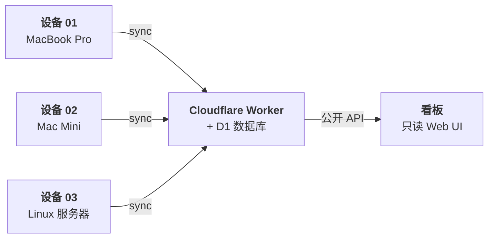

<p align="center"><code>npm i -g @aiusage/controller</code></p>

<p align="center">
  <strong>AIUsage</strong> 追踪所有 AI 工具在所有设备上的 Token 用量与成本，<br>
  同步到你自己的 Cloudflare Worker，通过公开看板可视化一切。
</p>

<p align="center">
  中文 | <a href="./README.md">English</a>
</p>

<p align="center">
  <a href="https://www.npmjs.com/package/@aiusage/controller"></a>
  <a href="LICENSE"></a>
  <a href="https://workers.cloudflare.com"></a>
  <a href="https://developers.cloudflare.com/d1"></a>
  <a href="https://react.dev"></a>
  <a href="https://pnpm.io"></a>
  <a href="https://www.typescriptlang.org"></a>
</p>

---

## AIUsage 是什么？

一套自托管、隐私优先的系统，用于追踪你在 AI 编程工具上的真实开销——跨所有设备。

### 支持的工具

<p align="center">
  
  
  
  
  
</p>
<p align="center">
  
  
  
  
  
</p>

### 为什么选择 AIUsage？

- **本地扫描** — 读取 AI 工具的会话日志，提取 Token 用量，不触及对话内容
- **多设备同步** — 每台机器独立注册，各自持有安全令牌，数据汇聚到你的 Worker
- **成本可视化** — 公开看板展示趋势、模型分布、单次成本等
- **数据自主** — 部署到你自己的 Cloudflare 账户（免费套餐足够），不依赖任何第三方

### 架构



## 快速开始

### 本地报告（无需服务端）

```bash
npm i -g @aiusage/controller

aiusage report --range 7d
```

### 部署服务端

前置条件：[Node.js](https://nodejs.org/) >= 18、[pnpm](https://pnpm.io/)、[Cloudflare](https://dash.cloudflare.com/) 账户

```bash
git clone https://github.com/ennann/aiusage.git
cd aiusage && pnpm install
npx wrangler login
pnpm setup
```

`pnpm setup` 会引导你完成全部流程——创建 D1 数据库、生成密钥、构建、部署。结束后会打印看板 URL、`SITE_ID` 和 `ENROLL_TOKEN`。

<details>
<summary>手动部署</summary>

```bash
npx wrangler d1 create aiusage-db
# 将 database_id 填入 packages/worker/wrangler.jsonc

npx wrangler d1 migrations apply aiusage-db --remote

npx wrangler secret put SITE_ID
npx wrangler secret put ENROLL_TOKEN
npx wrangler secret put DEVICE_TOKEN_SECRET
npx wrangler secret put PROJECT_NAME_SALT

pnpm build
cd packages/worker && npx wrangler deploy
```

配置模板见 `packages/worker/wrangler.jsonc.example`。
</details>

### 接入设备

```bash
npm i -g @aiusage/controller

aiusage enroll \
  --server https://your-worker.example.com \
  --site-id <SITE_ID> \
  --enroll-token <ENROLL_TOKEN> \
  --device-name "我的 MacBook"

aiusage sync --today
aiusage schedule        # 每 5 分钟自动同步
```

在每台机器上重复以上步骤，每台设备会获得独立的安全令牌。

## CLI 命令

| 命令 | 说明 |
|------|------|
| `aiusage report [--range 7d\|1m\|3m\|all]` | 本地用量报告（含成本估算） |
| `aiusage scan [--date YYYY-MM-DD]` | 扫描单日明细 |
| `aiusage sync [--today] [--lookback N]` | 上传数据到服务端 |
| `aiusage schedule [on\|off\|status]` | 定时同步（默认每 5 分钟） |
| `aiusage enroll` | 注册当前设备 |
| `aiusage doctor` | 诊断检查 |
| `aiusage config set <key> <value>` | 修改本地配置 |

## 隐私

仅上传聚合的 Token 计数——绝不上传对话内容。公开看板上的项目名支持三种模式：

| 模式 | 行为 |
|------|------|
| `masked`（默认） | 稳定伪名，如 `Project A1F4`（HMAC 生成） |
| `hidden` | 不展示项目维度 |
| `plain` | 真实项目名（仅限私有部署） |

## 项目结构

```
aiusage/
├── packages/
│   ├── controller/    # CLI 工具（npm: @aiusage/controller）
│   ├── worker/        # Cloudflare Worker + D1 API
│   ├── dashboard/     # React 分析看板
│   └── shared/        # 共享类型与常量
├── scripts/
│   └── setup.mjs      # 一键部署向导
└── docs/
    └── technical-design.md
```

## 文档

- [**技术设计文档**](./docs/design-docs/technical-design.md)
- [**Controller README**](./packages/controller/README.md)

## 开发

```bash
pnpm install
pnpm build
pnpm lint

cd packages/worker
npx wrangler d1 migrations apply aiusage-db --local
npx wrangler dev
```

## 许可证

[MIT](LICENSE)
